# Azure DevOps - Boards
This is a closed-loop integration with Azure DevOps Boards. It has a trigger that can be used to start a flow when there is a Work Item event like work item created or updated.  The included steps also allow you to create or update a work item and add comments.

### :scroll: DISCLAIMER
> ### The integrations here in the xMatters Labs are either still in-progress or experimental in nature, so we can offer only limited support here on GitHub. If you do run into any problems or have some feedback, join the discussion and ask the community at [https://support.xmatters.com/hc/en-us/community/topics](https://support.xmatters.com/hc/en-us/community/topics).

---
## Pre-Requisites
* Azure DevOps
    * Azure DevOps Services account
    * Permission to setup Service Hooks
    * Permission to setup Personal Access Tokens (You may want a special user account for the integration)
* xMatters
    * Account - if you don't have one [get one](https://www.xmatters.com) for free
    * Permissions to create/edit Workflows

---
## Files
* xMatters
    * [AzureDevOpsBoards.zip](xMatters/workflows/AzureDevOpsBoards.zip) - example workflow
    * [workItemEvent.js](xMatters/src/triggers/workItemEvent.js) - source code for trigger to recieve Work Item events
    * [createWorkItem.js](xMatters/src/steps/createWorkItem.js) - source code for step to create a Work Item
    * [updateWorkItem.js](xMatters/src/steps/updateWorkItem.js) - source code for step to update a Work Item
    * [addWorkItemComment.js](xMatters/src/steps/addWorkItemComment.js) - source code for step to add comments to Work Item
* Azure DevOps
    * [AzureDevOpsWorkItemFields.csv](AzureDevOps/AzureDevOpsWorkItemFields.csv) - CSV table of work item fields I discovered

---
## How It Works
The Service Hooks with in Azure DevOps will send notifications to the Work Item Event trigger in xMatters. This trigger can start a flow with in xMatters than can run any other steps or send notifications as you like.  It can also utilize the other Azure DevOps steps in this integration to manipulate Work Items.

There are steps to create a Work Item, update Work Items, and add comments to a Work Item. These steps have a few required values like the organization name, project name, and work item ID(required to update or add comments). If utilizing the included trigger it will provide this informaiton as outputs.

#### :warning: WARNING 
> Please keep in mind that if you are not careful you can create a loop between Azure DevOps and xMatters. For example if you have a Service Hook to notify xMatters of a Work Item update that triggers a flow that updates a Work Item. In these cases the create and update steps have an option called "suppressNotifications".  If this option is set to "true" it will tell Azure DevOps to not send a notification for this particular action. You can also make sure that your flow logic is checking for certain conditions before updating a work item. If set to defaults xMatters will catch floods and suppress them.

---
## Installation
### xMatters - Setup Inbound Trigger
#### :blue_book: NOTE
> If you do not already have an xMatters user specifically for integrations it is recommended to create one. This account should only be used for integrations and not need web login permissions. 
#### :warning: WARNING
> If the account you choose to use for this integration is removed or made inactive then the integration will break.

1. Under this integration user create a new API key to use with Azure DevOps. [Instructions](https://help.xmatters.com/ondemand/user/apikeys.htm)
    > :pencil2: *Make sure to note the key and secret for later when we configure Azure DevOps.*

    <kbd>
        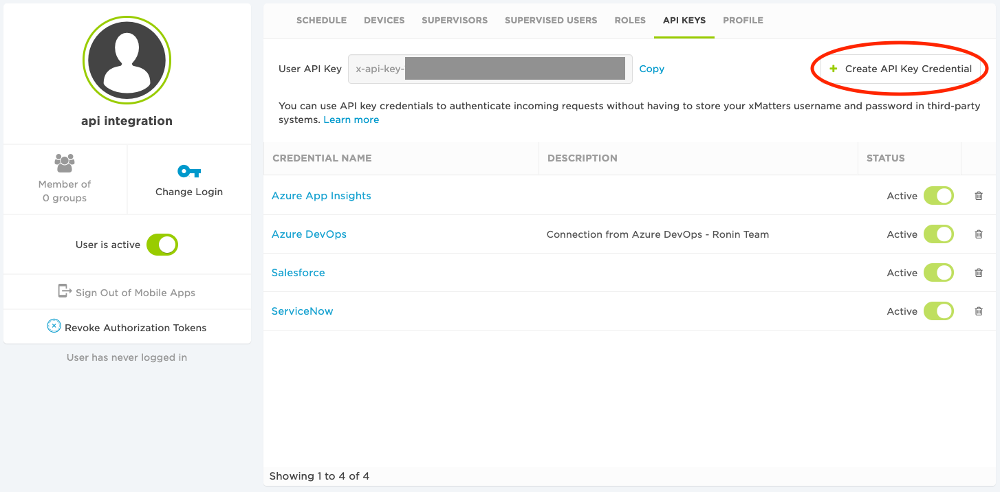
    </kbd>

2. Import the example workflow. [Instructions](https://help.xmatters.com/ondemand/xmodwelcome/workflows/manage-workflows.htm)

    <kbd>
        
    </kbd>

3.  Modify the **Work Item Created** form in the imported workflow and give the integration user sender permissions on the form. [Instructions](https://help.xmatters.com/ondemand/xmodwelcome/communicationplanbuilder/formpermissions.htm)

    <kbd>
        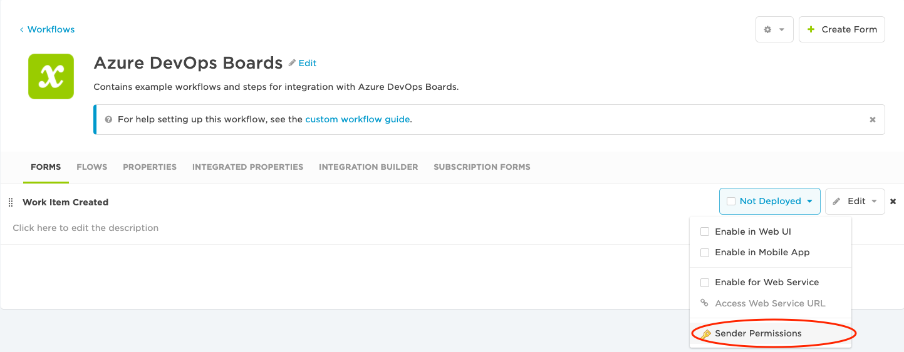
    </kbd>

4. Now open the corresponding flow **Work Item Created** and you will see a trigger at the top of the canvas called "**{Workflow Name} - Azure DevOps - Work Item Event**"
5. Hover over the trigger step and select edit.

    <kbd>
        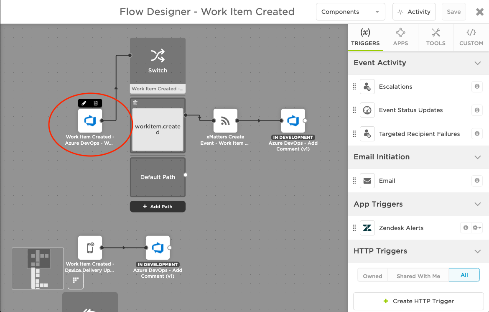
    </kbd>

6. On the Settings tab copy the trigger's URL and paste it in your notes for later.
    > :pencil2: *Make sure to save in your notes for later when we configure Azure DevOps.*

    <kbd>
        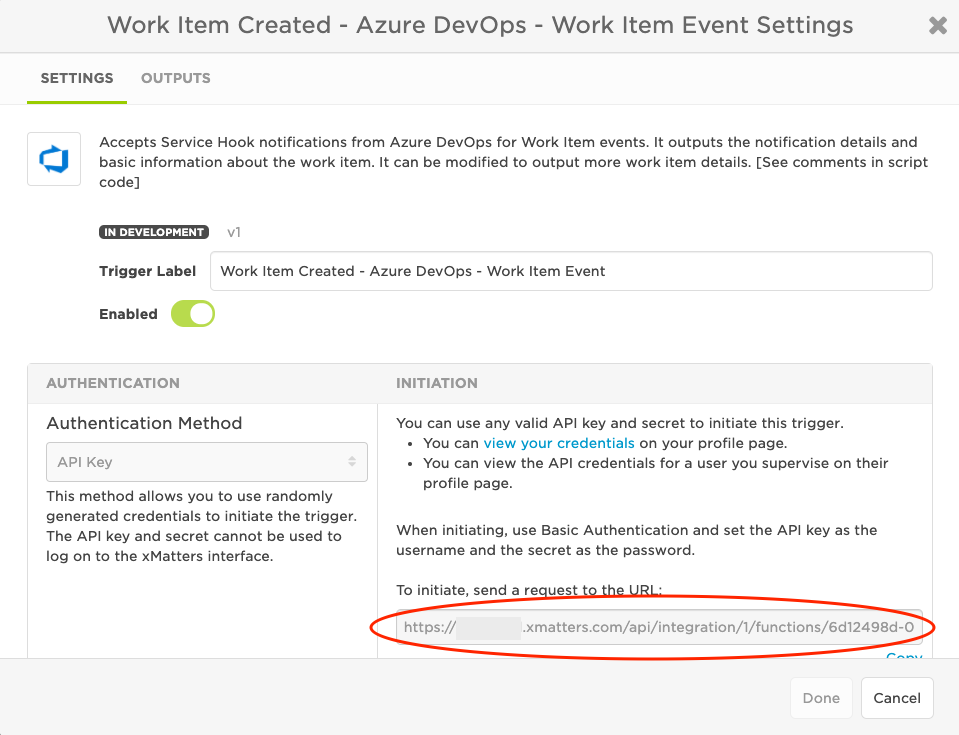
    </kbd>

### Azure DevOps - Setup Work Item Notification Subscriptions
We will now set things up on the Azure DevOps side, but we will come back to xMatters and finish up once we get some information from Azure DevOps.

1. Login in to your Azure DevOps organization and go to the project you want to setup the xMatters integration with.
2. Now go to the **Project Settings**
3. In the Project Settings menu select **Service hooks**
4. In the Service Hooks settings select the green + icon to add a new service hook subscription
5. In the subscription setup select **Web Hook** as the type and click Next

    <kbd>
        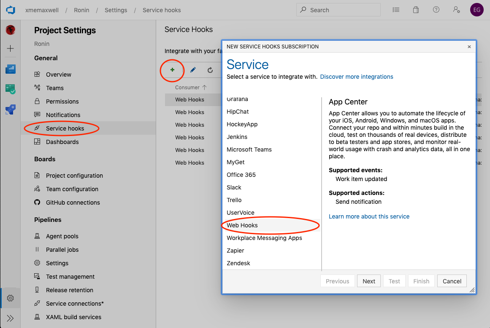
    </kbd>

6. Select **Work item created** as the trigger and set the filters however you like. Once complete click Next.
    
    <kbd>
        
    </kbd>

7. For the settings we will set the following values and the rest can be left as default.
    * **URL** - this is the URL you copied for the xMatters trigger and saved in your notes.
    * **Basic authentication username** - this will be the xMatters API key you created earlier
    * **Basic authentication password** - this will be the xMatters API key secret you created earlier

     
    <kbd>
        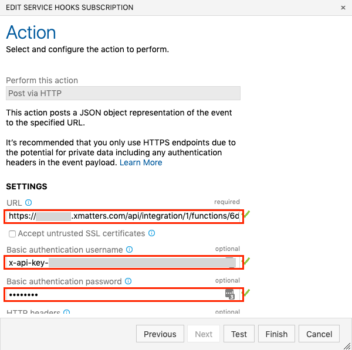
    </kbd>

8. Now click Test and it will send a request to xMatters letting you know if it was successful and have a response status code of 202. The xMatters workflow may fail, because the test is using a fake request but as long as the request was successful we are good here. If it failed you can look at the request and response and it could give you a clue as to why it did not succeed, but you may just need to verify
    * You copied the entire URL from the trigger in xMatters
    * The xMatters API key and secret are correct
    * Verify that the xMatters user that owns the API key has send permission on the Flow Form that the xMatters trigger is located.
    * Also make sure the workflow is enabled
    
     
    <kbd>
        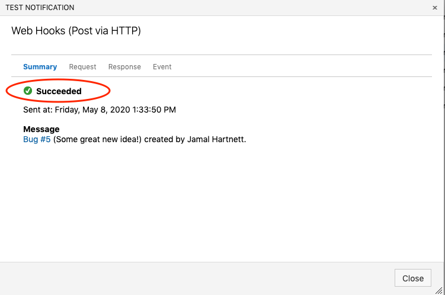
    </kbd>

    <kbd>
        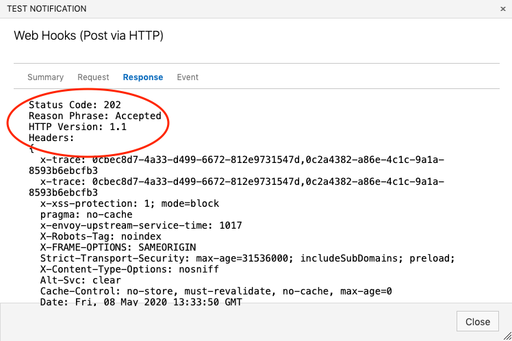
    </kbd>

9. Once it is successful click Finish.
10. You can repeat steps 4 - 9 to setup subscription notifications for other work item actions if you like.
    * Work item updated
    * Work item deleted
    * Work item restored

### Azure DevOps - Setup Credentials for xMatters
To use the Create/Update Work Item and Add Comment steps we need to setup credentials for xMatters to use to connect to Azure DevOps.  
#### :blue_book: NOTE
> We will be using a Personal Access Token and as good practice you probably want to use a specific Azure DevOps account for integrations. 

#### :warning: WARNING
>If you use an actual person's account and it is deactivated or deleted then the integration will break.

1. Login to Azure DevOps as the user you want to create the Personal Access Token under
2. In the top right select the icon with a person with a gear on it.  This will open user settings menu where you will select **Personal access tokens**

    <kbd>
        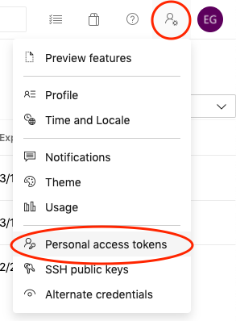
    </kbd>

3. Select **+ New Token** to create a new Personal Access Token

    <kbd>
        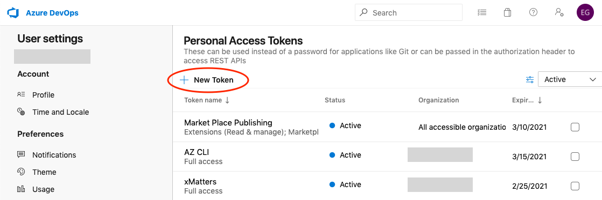
    </kbd>

4. Set the following values
    * **Name** - Give the token a descriptive name so that you know what it is for like "xMatters"
    * **Organization** - set the Azure DevOps organization you want this token to have access too
        * The user you are creating the token under must have access to the organization for them to show
    * **Expiration** - select **Custom Defined** and set it for the farthest date possible (1 year)

     
    <kbd>
        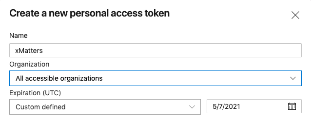
    </kbd>

5. For this integration the token should only need read, write, & manage access to Work Items, but as of writing this I have only tested with Full Access.  If you use the this token to perform other actions from xMatters it may need more permissions.

    <kbd>
        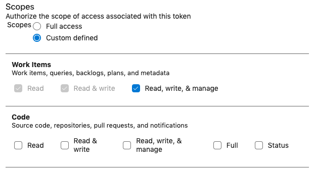
    </kbd>

6. Now copy the token that is generated.  
    > :pencil2: *Make sure you have a copy because once you close the window you can not see it again.*

    <kbd>
        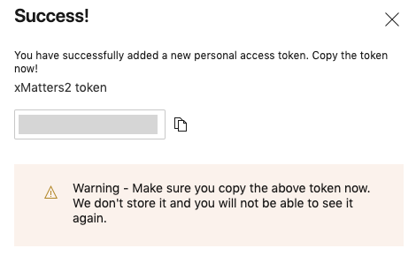
    </kbd>

### xMatters - Configure Azure DevOps Endpoint
We will now configure the Endpoint in xMatters so that it can connect to Azure DevOps to create and update work items.  I am still assuming you are using the imported example workflow.  If you are not then you can still follow along, but you will have to create the resources before you can configure them.

1. Open the **Work Item Created** flow in the **Azure DevOps Boards** workflow
2. In the top right open the **Components** menu and select **Endpoints**

    <kbd>
        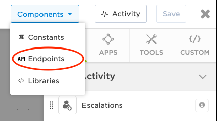
    </kbd>

3. Select the **Azure DevOps** endpoint.
4. We will need to set or verify these basic settings
    * **Name** - I would use "Azure DevOps" because the steps are already set to use this
    * **Base URL** - https://dev.azure.com
    * **Trust self-signed certificates** - disabled

     
    <kbd>
        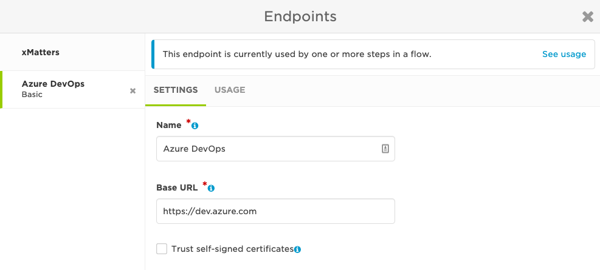
    </kbd>

5. For the endpoint Authentication we need to set the following
    * **Endpoint Type** - Basic
    * **Username** - this will be the Azure DevOps username of the account you created the Personal Access Token
    * **Password** - enter the Personal Access Token
    * **Preemptive** - enabled

     
    <kbd>
        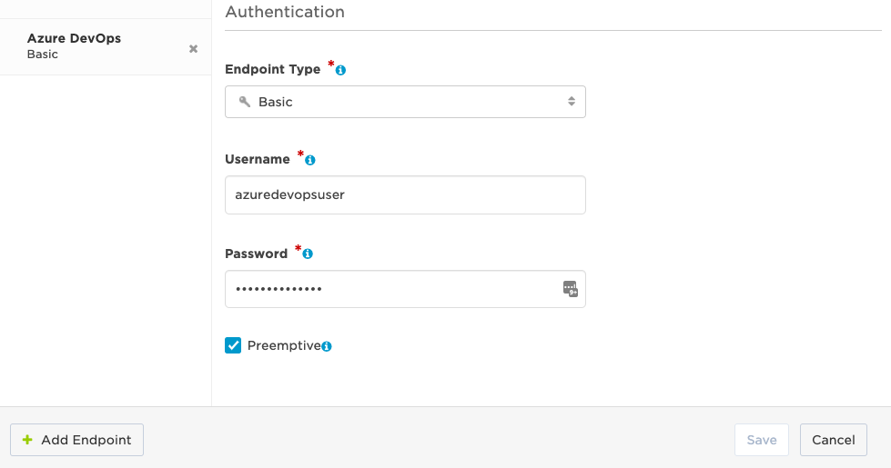
    </kbd>

6. Now save the Endpoint configuration

### xMatters - Configure Notifcation Recipients
The recipients in the event notification step in the exmaple workflow need to be set.

1. In the **Work Item Created** flow open the configuration for the **xMatters Create Event - Work Item Created - xMatters Event** step.

    <kbd>
        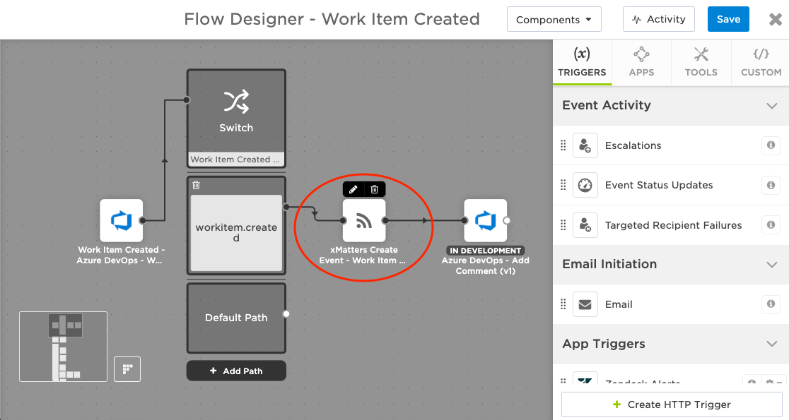
    </kbd>

2. In the setup add the xMatters users and/or groups you want to recieve the event notifications to the Recipients field. Click Done when complete.

    <kbd>
        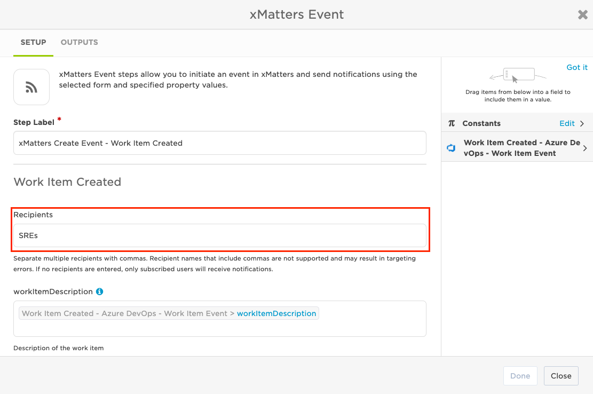
    </kbd>

3. Save the flow and you are done

---
## Testing
1. Go to Azure DevOps and create a new Work Item
2. The recipients that you configured in the event notification should receive a message on their configured xMatter devices with some basic work item information.
3. If everything is working you should see comments added to the Work Item with notification delivery information
4. The message will have 4 response options
    * **Acknowledge** - will add a comment to the Work Item that responder acknowledge the message
    * **Dismiss** - will add a commit to the Work Item that the responder dismissed the message and will stop notifying them
    * **Create Related Task** - this will create a Task work item and copy some of the information from the original work item
    * **Close Work Item** - this will close the original work item
5. Also, if the responder adds a comment to their response it will be added as a comment to the work item

---
## Expanding
These are some possible ways you can expand this integration with basic instructions.

### Azure DevOps - Work Item Event Trigger
The trigger provided has some standard outputs available for other steps to use. There is typically more information available about a work item
and the trigger is trying to parse out all the fields. You will see these in the trigger's output in the Activity monitor. If you want to use
one of these output values in another step copy or edit the trigger and add the output name to the trigger's Output configuration list.

### Azure DevOps - Create Work Item
This step includes some basic fields to configure when creating a new work item. If you want to set other fields that are not included you can
find the path to the field and added it following the pattern in the step script.  I was unable to find a document that gave all the fields, so
I would view the request from the **Azure DevOps - Work Item Event** trigger for the various available fields for each work item type. You can also
review the document [AzureDevOpsWorkItemFields.csv](AzureDevOps/AzureDevOpsWorkItemFields.csv) I put together of what I found.

### Azure DevOps - Update Work Item
This is very similar to the Create Work Item step and you can modify to add more fields to update just like the create step.

#### :warning: WARNING
> Keep in mind that if you modify the update step to add more fields make sure to follow the if statement pattern that checks the value of the step input. If you pass an empty value to Azure DevOps on an update it will either clear or default the filed value.

The update step does not have an append option for things like Description. Azure DevOps API does not have this as a feature, so in order to do this it would require making a request to get the current values. appending the new value, and submitting the update request.

---
## Troubleshooting
### xMatters Workflow Not Triggering
* Check in xMatters
    * Workflow Configuration
        * Verify that the xMatters user that owns the API key has send permission on the Flow Form that the xMatters trigger is located.
        * Also make sure the workflow is enabled
    * Check for Flow Errors
        * Open the Activity monitor in the xMatters flow and look for any errors
* Check in Azure DevOps
    * Service Hook Configuration
        * Verify you are using the correct xMatters trigger URL and that you entered the entire URL
        * Is the correct xMatters API key and secret
        * If you setup other filters are they filtering out your work item event
            * Example: You set a filter to only send alerts for a particular board and you created the work item in a different board
    

### Work Item is Not Created or Updated
* xMatters
    * Open the Activity monitor in the flow and very there are no errors
    * Make sure the Azure DevOps endpoint is configured correctly
        * Correct URL https://dev.azure.com
        * Using the username of the account that the Personal Access Token was created
        * Personal Access Token was entered correctly
    * Verify the steps that create or update work items are configured with the correct endpoint
* Azure DevOps
    * Verify the Personal Access Token has permissions to created and modify work items
    * Verify the Personal Access Token has not expired
